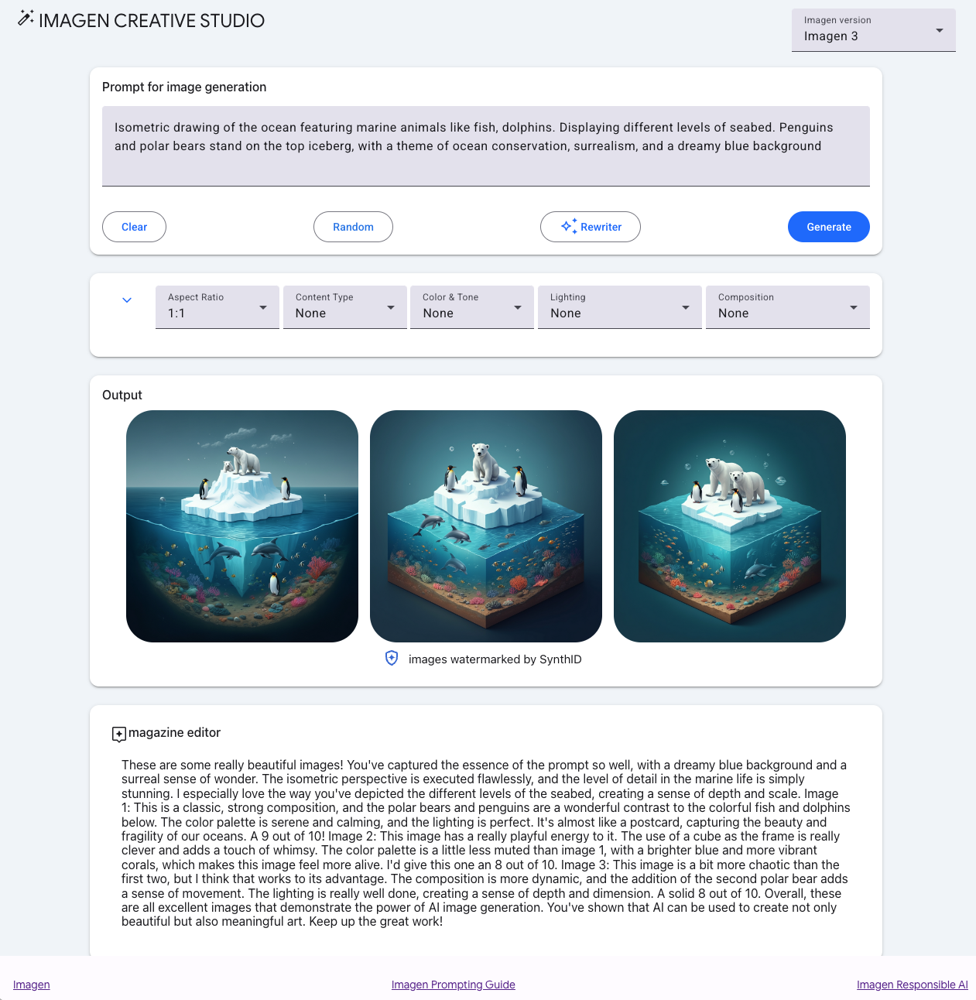

# Creative Studio | Vertex AI

Creative Studio is an app that highlights the capabilities of Google Cloud Vertex AI generative AI creative APIs, including Imagen, the text-to-image model.

Features Gemini for prompt rewriting as well as for a critic to provide a multimodal evaluation of the generated images. 

This app is built with [Mesop](https://google.github.io/mesop), a Python-based UI framework that allows you to rapidly build web apps like this demo and internal apps.


## GenMedia | Creative Studio




## Run locally

Two environment variables are required to run this application:

`PROJECT_ID`   
Provide an environment variable for your Google Cloud Project ID

```
export PROJECT_ID=$(gcloud config get project)
```

`IMAGE_CREATION_BUCKET`  
You'll need Google Cloud Storage bucket for the generative media. Note that this has to exist prior to running the application. 

If an existing Google Cloud Storage bucket is available, please provide its name without the `"gs://"` prefix.  

```
export IMAGE_CREATION_BUCKET=$PROJECT_ID-genmedia
```  

Otherwise, follow the next steps to create a storage bucket.  

### Create Storage Bucket (Optional) 

Please run the following command to obtain new credentials.  

```
gcloud auth login  
```  

If you have already logged in with a different account, run:  

```
gcloud config set account $PROJECT_ID  
```  

Create the storage bucket.  

```
gcloud storage buckets create gs://$BUCKET_NAME --location=US --default-storage-class=STANDARD
```

> **NOTE:** We have provided a `env_template` that you can use to in your development environment. Simply duplicate it, rename it to `.env` and replace `<YOUR_GCP_PROJECT_ID>` with your project ID.  

Then run `source .env` to add those variables into your environment.  


### Create Virtual Environment 

Create and activate a virtual environment for your solution. 
```
python3 -m venv venv 
source venv/bin/activate
```  

### Install requirements

Install the required Python libraries.

```
pip install -r requirements.txt
```

### Run with mesop

To run locally, use the `mesop` command and open the browser to the URL provided:

```
mesop main.py
```

> **NOTE:** The mesop application may request you to allow it to accept incoming network connections. Please accept to avoid limiting the application's behavior.  


## Deploy to Cloud Run

Deploy this application to a Cloud Run service.

It's recommended that you create a separate service account to deploy a Cloud Run Service.


```
export SA_NAME=sa-genmedia-creative-studio
export PROJECT_ID=$(gcloud config get project)

gcloud iam service-accounts create $SA_NAME --description="genmedia creative studio" --display-name="$SA_NAME"

gcloud projects add-iam-policy-binding $PROJECT_ID --member="serviceAccount:$SA_NAME@$PROJECT_ID.iam.gserviceaccount.com"  --role="roles/aiplatform.user"

gcloud projects add-iam-policy-binding $PROJECT_ID --member="serviceAccount:$SA_NAME@$PROJECT_ID.iam.gserviceaccount.com" --role="roles/storage.objectUser"
```

Deploy with the service account and environment variables created above; `PROJECT_ID` and `IMAGE_CREATION_BUCKET`.

```
gcloud run deploy creative-studio --source . \
  --allow-unauthenticated --region us-central1 \
  --service-account $SA_NAME@$PROJECT_ID.iam.gserviceaccount.com \
  --update-env-vars=IMAGE_CREATION_BUCKET=$IMAGE_CREATION_BUCKET,PROJECT_ID=$PROJECT_ID
```
