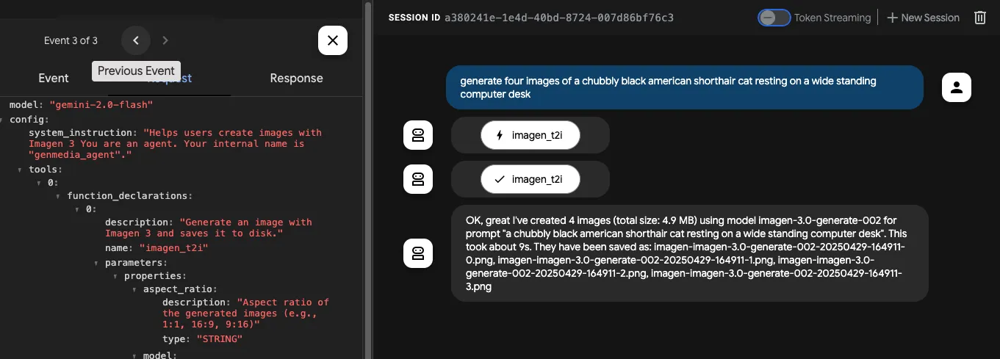

This directory contains a Google Cloud AI Agent Development Kit sample agent that uses the MCP genmedia tools.

## Prerequisites

Install the MCP Servers for Genmedia tools. This example uses the Go versions and assumes you've installed them locally.

## Setup

Add an .env file to the `genmedia_agent` agent directory:

```bash
GOOGLE_CLOUD_PROJECT="your-project-id"
GOOGLE_CLOUD_LOCATION="your-location" #e.g. us-central1
GOOGLE_GENAI_USE_VERTEXAI="True"
```

## MCP servers

The sample has since been reworked: the agent now wires four MCP toolsets
(`nanobanana`, `chirp3`, `veo`, `avtool`), all invoked as binaries on your
`PATH` over stdio — no separate server process needs to be started. See the
[current in-tree README](https://github.com/GoogleCloudPlatform/genmedia-creative-studio/blob/main/experiments/mcp-genmedia/sample-agents/adk/README.md)
for the up-to-date setup and toolset table.


## Run the ADK Developer UI

In this dir, start the adk web debug UX:

```bash
uv sync
source .venv/bin/activate
adk web
```

