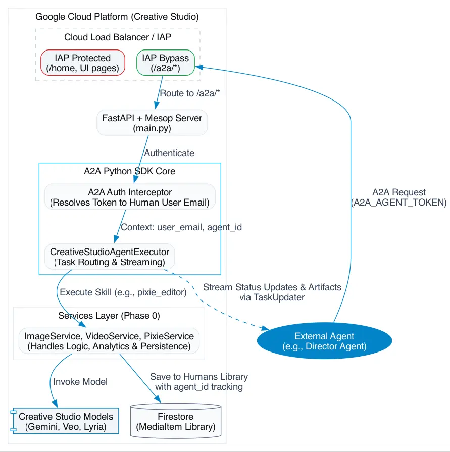

# GenMedia Creative Studio: A2A Integration Overview

## Overview
This document outlines the high-level strategy for exposing the GenMedia Creative Studio as an Agent-to-Agent (A2A) compliant service. 

By integrating the `a2a-sdk` (v1.0), we transform the Creative Studio from a purely human-driven Web UI into a programmable, headless creative engine. This empowers external, autonomous AI agents (such as generic Orchestrators, automated Scriptwriters, or Marketing agents) to programmatically request image, video, and audio generation via structured JSON-RPC or REST protocols.

## The Architectural Challenge: Human Identity vs. Machine Identity

GenMedia Creative Studio is currently built as a user-facing FastAPI monolith, heavily reliant on **Google Cloud Identity-Aware Proxy (IAP)** to protect proprietary models and internal data.

IAP is inherently designed for human-in-the-loop OAuth browser flows (expecting a Google login button and cookie session). Machine-to-machine (M2M) communication through IAP is notoriously hostile for external agents. 

Furthermore, the application's core business logic (invoking generative models, saving to Firestore, and logging analytics) is currently tightly coupled to the Mesop UI event handlers. This means an external agent invoking the raw models directly would bypass essential tracking and persistence mechanisms.

## Core Architecture Primer & Solution

To resolve the identity and coupling challenges, our solution introduces a clear boundary for M2M traffic and a secure Unified Services Layer.

### 1. IAP Bypass & Token-to-Human Mapping
Instead of spinning up a detached, polling background worker, we will integrate the A2A Python SDK directly into our existing FastAPI backend. 
*   We configure the Cloud Load Balancer to **bypass IAP** for the specific A2A routes (`/a2a/*`).
*   We protect these routes using the A2A SDK's native Auth Interceptors. External agents will authenticate using a generated `A2A_AGENT_TOKEN`.
*   The system resolves this token back to a human user's email, ensuring that all agent-generated media is securely saved to the correct human's Firestore library (tagged with an `agent_id`).

### 2. The Unified Services Layer (Phase 0)
Before exposing the A2A surface, we will extract the monolithic UI logic into a clean `services/` layer (e.g., `ImageService`, `VideoService`). Both the human-facing Mesop UI and the machine-facing A2A Executor will call this exact same layer. This guarantees absolute parity in generation, analytics, and persistence regardless of who (or what) initiated the request.

<picture>
  
</picture>

## Benefits to External Agents

By exposing Creative Studio via the A2A protocol, external agents gain access to a powerful, multi-modal creative toolkit:

1.  **UnifiedGenerative Primitives (Tier 1):** Agents can generate images (Nano Banana), video (Veo), music (Lyria), and speech (Gemini TTS) through a single, standardized API surface without managing underlying Google Cloud credentials or complex SDK payloads.
2.  **Stateful Streaming:** Leveraging the A2A `TaskUpdater`, external agents receive real-time, human-readable progress updates (e.g., "Generating 4 flat views...", "Stitching views...") for long-running generative tasks, preventing timeout disconnections and enabling better UX if the agent is proxying to an end-user.
3.  **Conversational Editing (Tier 2):** The **Pixie** persona allows external agents to collaborate on media editing. Instead of purely deterministic commands, an agent can ask Pixie open-ended questions about how to composite media and rely on its expertise before triggering rendering.
4.  **Workflow Offloading (Tier 3):* Agents can offload entire complex creative pipelines. For example, an external agent can invoke the `interior_design` skill by simply passing a floor plan image, relying on the Studio Agent to autonomously extract rooms, build 3D models, style them, and return a final video walkthrough.

---
*For detailed implementation steps, Capability Mapping, and Level of Effort (LOE) assessments, please see `a2a_plan.md`, `a2a_analysis.md`, and `services_refactor_loe.md`.*
