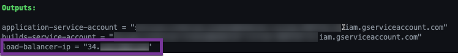
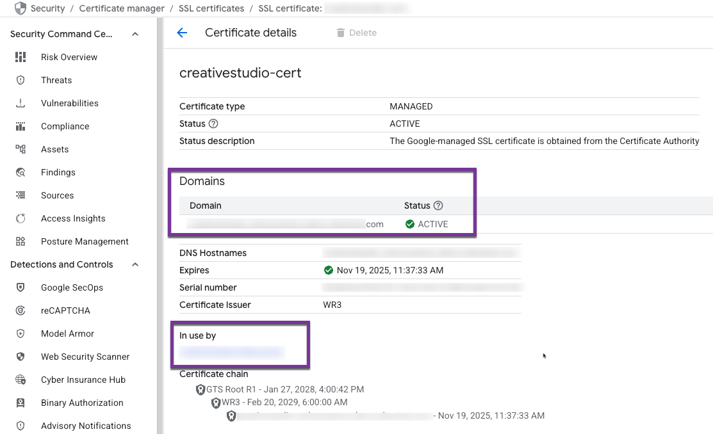
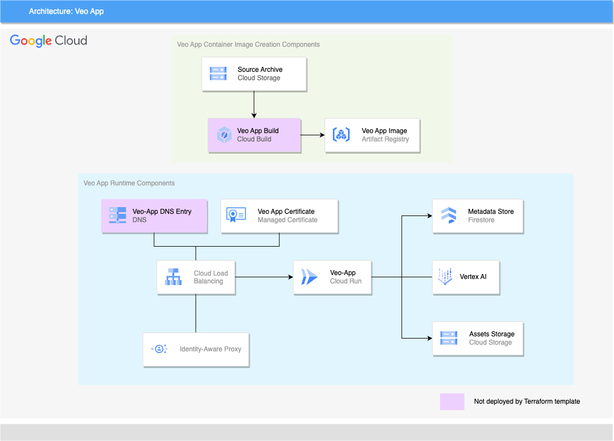

> ###### _This is not an officially supported Google product. This project is not eligible for the [Google Open Source Software Vulnerability Rewards Program](https://bughunters.google.com/open-source-security). This project is intended for demonstration purposes only. It is not intended for use in a production environment._

# Table of Contents
- [Table of Contents](#table-of-contents)
- [GenMedia Creative Studio: v.Next](#genmedia-creative-studio-vnext)
- [Deploying GenMedia Creative Studio](#deploying-genmedia-creative-studio)
  - [Prerequisites](#prerequisites)
  - [Deployment Steps](#deployment-steps)
    - [1. Download the source code for this project](#1-download-the-source-code-for-this-project)
    - [2. Export Environment Variables](#2-export-environment-variables)
    - [3. Initialize Terraform](#3-initialize-terraform)
    - [4. Create a DNS A record for the domain name](#4-create-a-dns-a-record-for-the-domain-name)
    - [5. Build and Deploy Container Image](#5-build-and-deploy-container-image)
    - [6. Wait for certificate to go to provisioned state](#6-wait-for-certificate-to-go-to-provisioned-state)
  - [Other ways of running](#other-ways-of-running)
    - [Cloud Run Domain](#cloud-run-domain)
    - [Cloud Shell](#cloud-shell)
- [Solution Design](#solution-design)
  - [Solution Components](#solution-components)
    - [Runtime Components](#runtime-components)
    - [Build time Components](#build-time-components)
  - [Setting up your development environment](#setting-up-your-development-environment)
    - [Python virtual environment](#python-virtual-environment)
    - [Application Environment variables](#application-environment-variables)
  - [GenMedia Creative Studio - v.next](#genmedia-creative-studio---vnext)
    - [Running](#running)
    - [Developing](#developing)
  - [Navigation](#navigation)
    - [How it Works](#how-it-works)
    - [Modifying the Navigation](#modifying-the-navigation)
    - [How to Control Navigation Items with Feature Flags](#how-to-control-navigation-items-with-feature-flags)
- [Disclaimer](#disclaimer)


# GenMedia Creative Studio: v.Next

This is the next gen version of GenMedia Creative Studio


Current featureset
* Text to Video: Create a video from a prompt.
* Image to Video: Create a video from an image + prompt.
* Library: Display the previous stored videos from Firestore index
* Veo 2, Veo 3 settings/features: Aspect ratio, Duration, Auto prompt enhancer


Future featureset

* Prompt rewriter
* Additional Veo 2 features: seed, negative prompt, person generation control
* Advanced Veo 2 features


This is built using [Mesop](https://mesop-dev.github.io/mesop/) with [scaffold for Studio style apps](https://github.com/ghchinoy/studio-scaffold).

# Deploying GenMedia Creative Studio

Deployment of GenMedia Creative Studio is accomplished using a combination of Terraform and Cloud Build. Terraform is used to deploy the infrastructure and Cloud Build is used to create the container image and update the Cloud Run service to use it.

## Prerequisites

You'll need the following
* An existing Google Cloud Project
* This source
* Ability to create a DNS A record for your target domain that resolves to the provisioned load balancer

## Deployment Steps

### 1. Download the source code for this project

Download the source and then change to this directory

```bash
git clone https://github.com/GoogleCloudPlatform/vertex-ai-creative-studio.git
cd vertex-ai-creative-studio/experiments/veo-app/
```

### 2. Export Environment Variables
The following environment variables are the minimum required to deploy the application.

* REGION - Should be set to `us-central1`. Prior to selecting a different region, validate the GenAI models needed are available [here](https://cloud.google.com/vertex-ai/generative-ai/docs/learn/locations#google_model_endpoint_locations).
* PROJECT_ID - Set to the desired Google Cloud project's ID, obtained via `gcloud` below or you can enter it manually.
* DOMAIN_NAME - Update with the DNS name to be used to reach the web application (e.g., creativestudio.example.com). A Google Cloud Managed certificate will be created for this domain.
* INITIAL_USER - Email address of initial user given access to the web application (e.g., admin@example.com)

Replace the example values and execute the script below:

```bash
export REGION=us-central1 PROJECT_ID=$(gcloud config get project) 
export DOMAIN_NAME=creativestudio.example.com
export INITIAL_USER=admin@example.com
```

### 3. Initialize Terraform

Make sure your command line is in the folder containing this README (i.e., experiments/veo-app). Then create the `terraform.tfvars` using the following command:

```bash
cat > terraform.tfvars << EOF
project_id = $PROJECT_ID
domain = $DOMAIN_NAME
initial_user = $INITIAL_USER
EOF

terraform init
terraform apply
```
### 4. Create a DNS A record for the domain name
A load balancer and a Google Cloud managed certificate are provisioned by the Terraform configuration file. You must create a DNS A record that resolves to the IP address of the provisioned load balancer. Below is a sample output from running the `terraform apply` command, showing where the provisioned application balancer's IP is displayed.



If you use Google Cloud DNS, follow the steps [here](https://cloud.google.com/dns/docs/records). Provisioning a Google-managed certificate might take up to 60 minutes from the moment your DNS and load balancer configuration changes have propagated across the internet.

> If you take too long to create the A record, usually >15 minutes or the DNS entry resolves to any other IP address than the load balancer's, provisioning of the Google Cloud Managed certificate may fail with a status of `FAILED_NOT_VISIBLE`. If this is the case, make sure the DNS A record is updated correctly and follow the steps [here](https://cloud.google.com/load-balancing/docs/ssl-certificates/troubleshooting?#verify_configuration_changes).

### 5. Build and Deploy Container Image
A shell script, `build.sh`, is include in this repo that submits a build to Cloud Build which builds and deploys the application's container image. Use the following command:

```bash
.\build.sh
```

### 6. Wait for certificate to go to provisioned state

With both the infrastructure and application deployed, you are just waiting for the certificate to complete provisioning. Once you see the status as "ACTIVE" and the "In use by" section populated (see sample below), your application is ready for use. You can navigate to the [Certificate Manager GCP Console page](https://console.cloud.google.com/security/ccm/list/lbCertificates), and select the certificate to keep an eye on the status.



## Other ways of running

### Cloud Run Domain
If you are unable to create a DNS record in your corporate domain, you can also use the autogenerated Cloud Run domain along with it's preview support for IAP to secure the endpoint.

At this point, the Terraform config files do not support this option.

### Cloud Shell
Use this option if you want to quickly run the UI without having to setup a local development environment. To get started, use Cloud Shell and follow the tutorial instructions.

  [](https://shell.cloud.google.com/cloudshell/editor?cloudshell_git_repo=https://github.com/GoogleCloudPlatform/vertex-ai-creative-studio.git&cloudshell_workspace=experiments/veo-app&cloudshell_tutorial=tutorial.md)

# Solution Design


The above diagram depicts the components that make up the Creative Studio solution. Items of note:

* DNS entry _is not_ deployed as part of the provided Terraform configuration files. You will need to create a DNS A record that resolves to the IP address of the provisioned load balancer so that certificate provisioning succeeds.
* Users are authenticated with Google Accounts and access is [managed through Identity Aware Proxy (IAP)](https://cloud.google.com/iap/docs/managing-access). IAP does support external identities and you can learn more [here](https://cloud.google.com/iap/docs/enable-external-identities).


## Solution Components

### Runtime Components
* [Load Balancer](https://cloud.google.com/load-balancing) - Provides the HTTP access to the Cloud Run hosted application
* [Identity Aware Proxy](https://cloud.google.com/security/products/iap) - Limits access to web application for only authenticated users or groups
* [Cloud Run](https://cloud.google.com/run) - Serverless container runtime used to host Mesop application
* [Cloud Firestore](https://firebase.google.com/docs/firestore) - Data store for the image / video / audio metadata. If you're new to Firebase, a great starting point is [here](https://firebase.google.com/docs/projects/learn-more#firebase-cloud-relationship).
* [Cloud Storage](https://cloud.google.com/storage) - A bucket is used to store the image / video / audio files

### Build time Components
* [Cloud Build](https://cloud.google.com/build) - Uses build packs to create the container images, push them to Artifact Registry and update the Cloud Run service to use the latest image version. To simplify deployment, connections to a GitHub project and triggers are not deployed w/Terraform. The source code that was cloned locally is compressed and pushed to Cloud Storage. It is this snapshot of the source that is used to build the container image.
* [Artifact Registry](https://cloud.google.com/artifact-registry/docs/overview) - Used to store the container images for the web aplication
* [Cloud Storage](https://cloud.google.com/storage) - A bucket is used to store a compressed file of the source used for the build

## Setting up your development environment

### Python virtual environment

A python virtual environment, with required packages installed.

Using the [uv](https://github.com/astral-sh/uv) virtual environment and package manager:

```
# sync the requirements to a virtual environment
uv sync
```

If you've done this before, you can also use the command `uv sync --upgrade` to check for any package version upgrades.

### Application Environment variables

Use the included dotenv.template and create a `.env` file with your specific environment variables. 

Only one environment variable is required:

* `PROJECT_ID` your Google Cloud Project ID, obtained via `gcloud config get project`

See the template dotenv.template file for the defaults and what environment variable options are available.

## GenMedia Creative Studio - v.next

### Running
Once you have your environment variables set, either on the command line or an in .env file:

```bash
uv run main.py
```

### Developing

Using the Mesop app in a virtual environment provides the best debugging and building experience as it supports hot reload.

```bash
source .venv/bin/activate
```

Start the app, use the Mesop command in your python virutal environment

```bash
mesop main.py
```

## Navigation

The application's side navigation is dynamically generated from the `config/navigation.json` file. This approach allows for easy updates to the navigation structure without modifying Python code.

### How it Works

When the application starts, it reads `config/navigation.json` and uses Pydantic models to validate the structure of the navigation items. This ensures that each entry has the required fields and correct data types, preventing runtime errors.

### Modifying the Navigation

To add, remove, or modify a navigation link, simply edit the `config/navigation.json` file. Each item in the `pages` list is a JSON object with the following structure:

*   `id` (required, integer): A unique identifier for the navigation item. The list is sorted by this value.
*   `display` (required, string): The text that will be displayed for the link.
*   `icon` (required, string): The name of the [Material Symbol](https://fonts.google.com/icons) to display.
*   `route` (optional, string): The application route to navigate to (e.g., `/home`).
*   `group` (optional, string): The group the item belongs to (e.g., `foundation`, `workflows`, `app`).
*   `align` (optional, string): Set to `bottom` to align the item to the bottom of the navigation panel.

### How to Control Navigation Items with Feature Flags

You can temporarily hide or show a navigation item by using a feature flag in `navigation.json` and controlling it via your `.env` file.

**1. Add the Feature Flag:**
First, add a `feature_flag` key to the item you want to control in `config/navigation.json`. Give it a descriptive name, for example:

```json
{
  "id": 40,
  "display": "Motion Portraits",
  "icon": "portrait",
  "route": "/motion_portraits",
  "group": "workflows",
  "feature_flag": "MOTION_PORTRAITS_ENABLED"
}
```

**2. Control Visibility via `.env` file:**
Now, you can control whether this item appears in the navigation by setting the `MOTION_PORTRAITS_ENABLED` variable in your `.env` file.

*   **To HIDE the page:** Either **do not** include `MOTION_PORTRAITS_ENABLED` in your `.env` file, or set it to `False`.
*   **To SHOW the page:** Add `MOTION_PORTRAITS_ENABLED=True` to your `.env` file.

The application will automatically show or hide the link when you restart it.


# Disclaimer

This is not an officially supported Google product. This project is not eligible for the [Google Open Source Software Vulnerability Rewards Program](https://bughunters.google.com/open-source-security).

